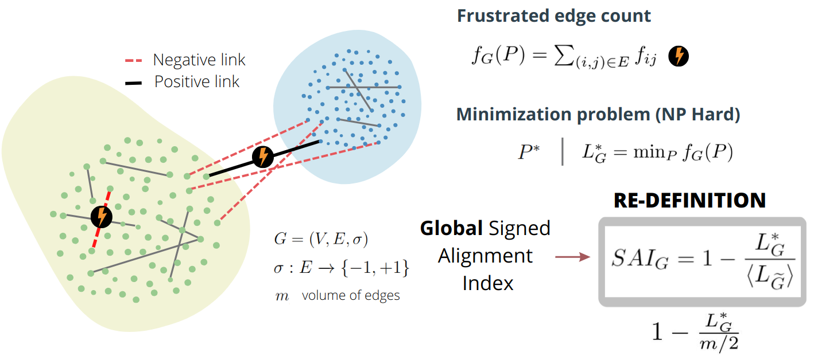
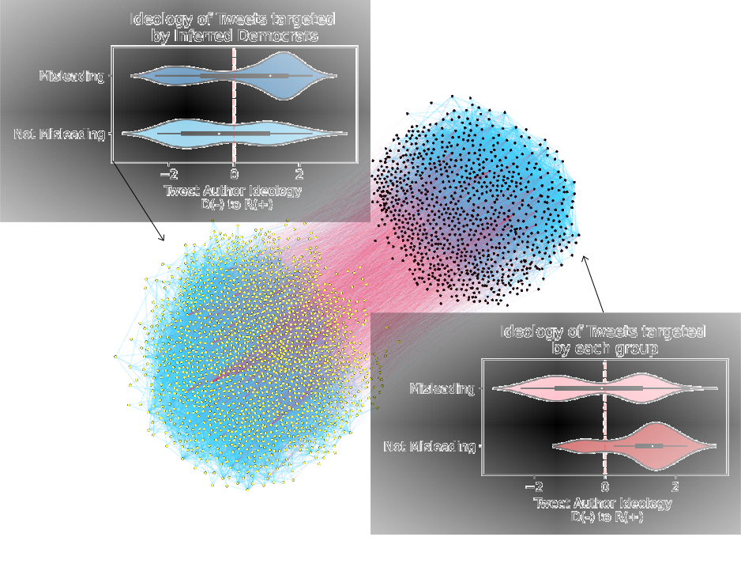

```{r xaringan-themer, include=FALSE, warning=FALSE}
#This block contains the theme configuration for the CSS lab slides style
library(xaringanthemer)
library(showtext)
style_mono_accent(
  base_color = "#5c5c5c",
  text_font_size = "1.5rem",
  header_font_google = google_font("Arial"),
  text_font_google   = google_font("Arial", "300", "300i"),
  code_font_google   = google_font("Fira Mono")
)
```

```{r setup, include=FALSE}
options(htmltools.dir.version = FALSE)
```


layout: true
<div class="my-footer"><span>David Garcia - Unpacking Polarization</span></div> 

---

background-image: url(figures/AboutUS.svg)
background-size: 98%

---

# Mitigating Online Polarization


 <font size="5">

- Changes in feed algorithms have weak effects if applied only to part of the population
- Alternative: recommend content with cross-partisan appeal
  - It can be contentious but not necessarily across the polarization fault line
  - What and when? Finding this content requires new models and methods

[Influence of Facebook algorithms on political polarization tested. David Garcia. Nature (2023)](https://rdcu.be/djT2c)
[Breaking the Social Media Prism: How to Make Our Platforms Less Polarizing. Chris Bail (2021)](https://press.princeton.edu/books/hardcover/9780691203423/breaking-the-social-media-prism)
</font>

---
# Unpacking Polarization
.center[]
 <font size="5">
[Unpacking polarization: Antagonism and Alignment in Signed Networks of Online Interaction. E. Fraxanet, M. Pellert, S. Schweighofer, V. Gómez, D. Garcia. Arxiv preprint (2023)](https://arxiv.org/abs/2307.06571)
 </font>
---

# Data on Signed Online Discussions

.center[]
Birdwatch (now Community Notes) and DerStandard comments (Austrian news)
---

## From Interactions to Relations to Polarization


---
# Edge Frustration and Signed Alignment
.center[]
 <font size="5">
[Balance and frustration in signed networks. S. Aref and M. Wilson. Complex Networks (2019)](https://doi.org/10.1093/comnet/cny015)
 </font>
---

# Alignment versus Antagonism

.center[]

---
# Unpacking Polarization Pipeline

.center[]

---
.center[]
---

## Temporal Evolution of Birdwatch

.center[]
---

## Peaks and events in Birdwatch
.center[]

---

## Antagonism and Alignment in Der Standard

.center[]

---

# Effects Over Time in Der Standard

.center[]

---

# Elections and Alignment in Der Standard

.center[]

---

# Summary

- Aim: Finding topics and times where Alignment is low but Antagonism is high
- Developed a method to unpack Antagonism and Alignment based on frustrated edges (and a maximizing partition of the network)
- Cohesiveness and Divisiveness components of Alignment
- Needs new data: Birdwatch and DerStandard
- A first application is aligned with previous observations in Birdwatch, and highlights contientious topics
- Decreases in alignment after elections as a validity test


[Unpacking polarization: Antagonism and Alignment in Signed Networks of Online Interaction. Emma Fraxanet, Max Pellert, Simon Schweighofer, Vicenç Gómez, David Garcia. Arxiv preprint (2023)](https://arxiv.org/abs/2307.06571)

.center[**More at: [www.dgarcia.eu](https://dgarcia.eu) and [@dgarcia_eu](https://twitter.com/dgarcia_eu)**  
**Thanks for listening!**]